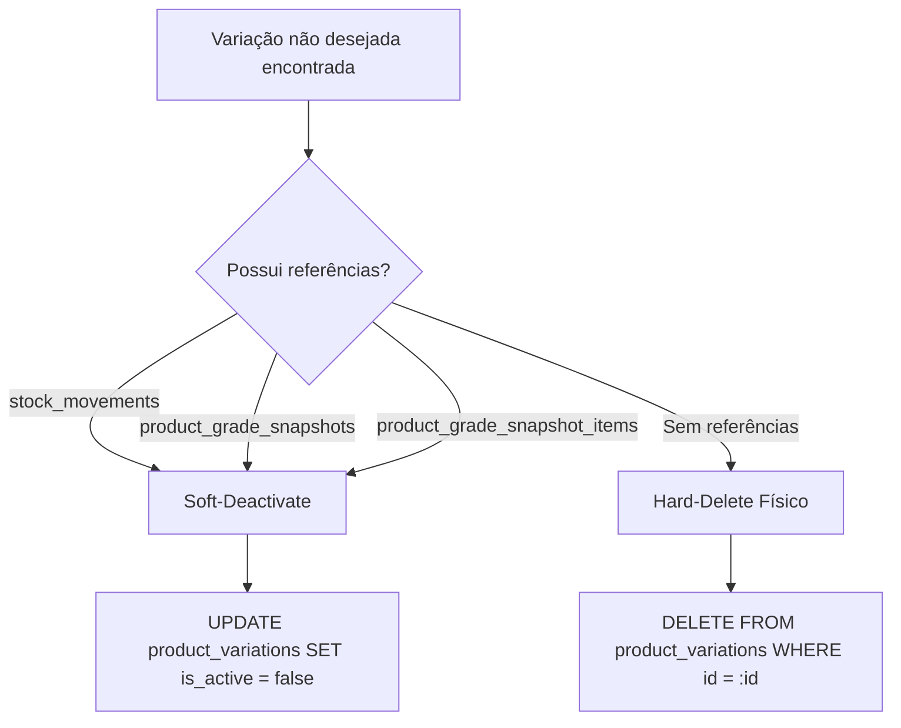

# B2XCATALOGO — Product Variation Reconciliation & Atomic Snapshot Engine
**Documento Arquitetural — Sprint 10.2**
**Status:** IMPLEMENTED / VERIFIED
**Data:** 05/10/2026

---

## 1. Contexto e Problema Resolvido

Anteriormente, o hook `useProductVariations.saveVariations()` utilizava uma estratégia destrutiva de persistência:
```sql
DELETE FROM product_variations WHERE product_id = :product_id;
INSERT INTO product_variations (...) VALUES (...);
```

### Consequências Críticas do Padrão Destrutivo:
1. **Quebra de Chaves Estrangeiras e Integridade Referencial**: Com a introdução do Ledger de Inventário (`stock_movements.variation_id`) e do Grade Engine (`product_grade_snapshots.pack_variation_id`, `product_grade_snapshot_items.variation_id`), os IDs de variação passaram a ser a identidade canônica das entidades no banco de dados. Apagar todas as variações destruía o histórico de movimentações ou provocava falha de restrição `FOREIGN KEY`.
2. **Perda de Rastreabilidade Histórica**: Caso o usuário desmarcasse uma cor ou tamanho temporariamente, todo o histórico de transações e pedidos daquela variação era perdido ou corrompido.
3. **Sobrescrita Acidental de Saldo de Estoque**: O formulário do wizard mantinha estados estáticos ou desatualizados de estoque (e.g. `formData.stock`), sobrescrevendo valores ativos calculados pelo ledger.
4. **Ausência de Snapshots Canônicos**: O wizard persistia grades apenas nas colunas de projeção `grade_sizes` e `grade_pairs`, sem gerar `product_grade_snapshots` canônicos.

---

## 2. Nova Arquitetura de Reconciliação (`variationReconciliationService.ts`)

O serviço [`variationReconciliationService.ts`](file:///e:/projetos/B2XCATALOGO/catalogo/src/lib/variationReconciliationService.ts) implementa um mecanismo determinístico de reconciliação de estado entre o **Estado Persistido no Banco** e o **Estado Desejado pelo Wizard**.

```text
┌────────────────────────────────────────────────────────────────────────────┐
│                    reconcileProductVariations(...)                         │
├────────────────────────────────────────────────────────────────────────────┤
│ 1. Buscar variações existentes no banco (SELECT * WHERE product_id = :id)  │
│ 2. Buscar snapshots existentes associados ao produto                       │
│ 3. Classificar variações:                                                  │
│    ├── UNCHANGED: Mesma identidade e mesma composição                      │
│    ├── UPDATE: Mesma identidade, mas metadados alterados (preço, SKU)      │
│    ├── CREATE: Novo tamanho/cor ou nova grade selecionada                  │
│    └── REMOVED: Presente no banco mas ausente no formulário                │
│ 4. Executar transações atômicas de criação de grade (RPC ou fallback)     │
│ 5. Executar updates de variações existentes (PRESERVANDO IDs e ESTOQUE)    │
│ 6. Aplicar Política de Remoção Segura (Soft-Deactivate vs Hard-Delete)     │
└────────────────────────────────────────────────────────────────────────────┘
```

---

## 3. Identidade da Variação (Identity Matching)

A identificação de uma variação segue uma hierarquia estrita de precedência:

1. **Precedência 1 — ID Explícito**:
   Se o objeto do formulário carrega um `id` válido já persistido no Supabase, a variação é identificada diretamente por `variation.id`.
2. **Precedência 2 — Par Natural de Domínio (Fallback para novos formulários)**:
   - **Variações de Grade (`is_grade = true`)**: Identificadas por `color` + `grade_name` (ou template).
   - **Variações Unitárias (`is_grade = false`)**: Identificadas pelo par natural `(color, size)`.

Essa abordagem impede tanto a recriação desnecessária de IDs quanto o matching incorreto por índice de array (`array[0] == array[0]`).

---

## 4. Política de Remoção Segura (Removal Policy)

Quando uma variação persistida no banco não está presente no estado desejado do wizard:



1. **Verificação de Dependências**:
   - `stock_movements`: Se existem movimentações associadas a `variation_id`.
   - `product_grade_snapshots`: Se a variação é `pack_variation_id` de algum snapshot.
   - `product_grade_snapshot_items`: Se a variação é referenciada como item de grade.
2. **Soft-Deactivate (`is_active = false`)**:
   Se houver histórico, a variação é desativada logicamente sem apagar o registro físico nem quebrar integridade referencial.
3. **Hard-Delete Seguro**:
   Apenas variações comprovadamente recém-criadas e sem nenhum vínculo com o ledger ou snapshots são deletadas fisicamente.

---

## 5. Geração Atômica de Snapshots de Grade

Para cada variação de grade configurada no wizard:

### Fluxo Canônico:
1. **Detecção de Mudança de Composição (`isGradeCompositionEqual`)**:
   - Compara deterministamente `grade_sizes` (tamanho e quantidade de pares) e atributos como `grade_name` e `color`.
   - **Se a grade não mudou**: Preserva o `snapshot_id` existente e a `pack_variation.id`. Não gera registros duplicados.
   - **Se a grade mudou ou é nova**:
     - Cria registro canônico em `product_grade_snapshots` com `template_id` (se originado de modelo de loja) ou `NULL` (ad-hoc custom).
     - Cria itens canônicos em `product_grade_snapshot_items` (`size`, `quantity`, `variation_id = null`).
     - Cria a `pack_variation` associada em `product_variations` com `is_grade = true` e `stock = 0`.
     - Vincula `product_grade_snapshots.pack_variation_id = pack_variation.id`.
     - Preenche a **Compatibility Projection** (`grade_sizes`, `grade_pairs`, `grade_name`, `grade_color`, `sku`, `price`) para o frontend legado.

---

## 6. Preflight Gate — Atomicidade de Templates Customizados

Na Sprint 10.1 foi adicionada a criação de templates customizados (`useGradeTemplates.createCustomTemplate()`). Na Sprint 10.2 foi adicionada a RPC transacional `create_custom_grade_template`:
- Insere `grade_templates` e `grade_template_items` em bloco transacional atômico no PostgreSQL (`supabase/migrations/20261005000007_atomic_grade_and_variation_rpcs.sql`).
- Caso a inserção de itens falhe, o template sofre rollback automático, prevenindo templates órfãos ou incompletos.
- Fallback em cliente com cleanup automático em bloco `catch` caso a RPC não esteja provisionada no ambiente.

---

## 7. Garantias de Estoque

1. **Variações Existentes**: O `reconcileProductVariations` **nunca** sobrescreve `stock` ou `reserved_stock` com valores de formulário do wizard. O saldo persistido no banco é preservado integralmente.
2. **Novas Variações de Grade (Pack Variations)**: Inicializadas obrigatoriamente com `stock = 0`.
3. **Zero Stock Movements**: A criação ou reconciliação de grade **não gera** nenhum movimento em `stock_movements`. O inventário deve ser alimentado posteriormente por fluxos explícitos (e.g. `ProductStockManagerModal` / RPC `apply_stock_adjustment`).

---

## 8. Verificação e Testes

- **Unit Tests do Reconciliador**: [`variationReconciliationService.test.ts`](file:///e:/projetos/B2XCATALOGO/catalogo/src/lib/__tests__/variationReconciliationService.test.ts) validando:
  1. Preservação de IDs de variações existentes.
  2. Proteção de estoque persistido contra sobrescrita de formulário.
  3. Inicialização de novas pack variations com `stock = 0`.
  4. Comparador determinístico de composição `isGradeCompositionEqual`.
  5. Criação de novas variações unitárias com geração de novos IDs.
- **Unit Tests do Adapter de Grade**: [`gradeDomainAdapter.test.ts`](file:///e:/projetos/B2XCATALOGO/catalogo/src/lib/__tests__/gradeDomainAdapter.test.ts) (5/5 passing).
- **Backend MCP Test Suite**: 103/103 passing.
- **Frontend & MCP Builds**: 100% clean.
